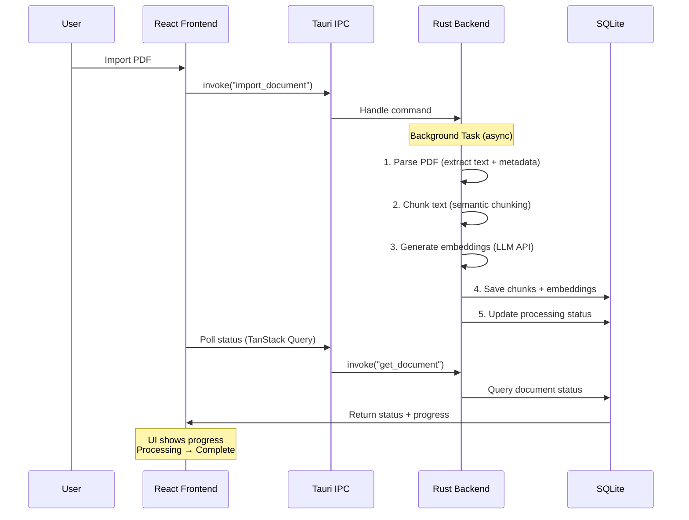

# MiniClue

**A local-first desktop app for chatting with your PDF documents**

## 1. Overview

MiniClue is a privacy-focused desktop application that lets anyone chat with their PDF documents using AI. All your data stays local on your machine - no cloud storage, no servers, just you and your documents.

**Key Features:**

- 🔒 **Local-first**: All PDFs and data stored locally on your machine
- 🤖 **Multiple LLM Support**: OpenAI, Anthropic, Gemini, xAI, DeepSeek
- ⚡ **Fast**: Rust backend with SQLite and vector search
- 🎨 **Modern UI**: React 19 with TanStack Router and shadcn/ui
- 🔍 **RAG-Powered**: Semantic search over your documents with embeddings

---

## 2. Architecture

MiniClue is built as a **Tauri desktop app** with a clean separation between frontend and backend:

```
hartford/
├── src/                    # Frontend: Vite + React 19
│   ├── routes/            # TanStack Router pages
│   ├── components/        # UI components (shadcn/ui)
│   ├── hooks/             # React hooks
│   └── lib/               # Utilities, Tauri IPC wrappers
│
├── src-tauri/             # Backend: Rust + Tauri 2
│   ├── src/
│   │   ├── commands/      # Tauri IPC handlers
│   │   ├── services/      # Business logic
│   │   ├── db/            # SQLite repositories
│   │   ├── models/        # Data models
│   │   ├── pipeline/      # PDF processing pipeline
│   │   ├── rag/           # RAG chat logic
│   │   └── config.rs      # App configuration
│   └── migrations/        # SQLx database migrations
│
└── apps/                  # Legacy web monorepo (reference only)
```

### Tech Stack

| Layer    | Technology                                                                                                  |
| -------- | ----------------------------------------------------------------------------------------------------------- |
| Frontend | Vite + React 19<br>• TanStack Router, TanStack Query<br>• shadcn/ui components<br>• Tauri Specta bindings   |
| Backend  | Rust + Tauri 2<br>• SQLite + sqlx (migrations)<br>• sqlite-vec (vector search)<br>• Tauri IPC (type-safe)   |
| LLM APIs | OpenAI, Anthropic, Gemini, xAI, DeepSeek<br>• Text generation, embeddings, streaming                        |
| Storage  | Local filesystem<br>• macOS: `~/Library/Application Support/com.miniclue.app/`<br>• PDFs, SQLite DB, config |

---

## 3. Getting Started

### Prerequisites

- **Node.js** >= 20.x
- **pnpm** >= 10.x
- **Rust toolchain** (for Tauri) - Install via [rustup](https://rustup.rs/)
- **Network access during build** - Pdfium binaries are downloaded automatically at build time

### Quick Start

```bash
# 1. Install dependencies
pnpm install

# 2. Start Tauri app in dev mode (Vite + Rust hot reload)
pnpm dev
```

That's it! The app will launch with hot reloading enabled.

On first build, `src-tauri/build.rs` downloads a platform-specific Pdfium binary (currently Chromium `7543`) into `src-tauri/resources/pdfium/`.
Manual Pdfium installation is not required.

If download fails (offline/proxy), the Rust build fails with an explicit error so packaged builds never ship without Pdfium.

### Development Commands

```bash
# Development
pnpm dev              # Start Tauri app in dev mode
pnpm dev:fe           # Start Vite dev server only (frontend)

# Build
pnpm build            # Build production Tauri app for current platform
pnpm build:fe         # Build frontend only (TypeScript + Vite)
pnpm preview          # Preview production build locally

# Type Safety
pnpm gen:bindings     # Regenerate TypeScript bindings from Rust

# Frontend Quality Checks
pnpm test:ts          # Type check TypeScript (no emit)
pnpm lint             # Lint frontend code with Biome
pnpm lint:fix         # Auto-fix linting issues
pnpm format           # Format code with Biome
pnpm format:check     # Check if code is formatted (no write)
pnpm fix              # Auto-fix lint + format (lint:fix && format)
pnpm check            # Run all checks: type-check + format-check + lint

# Rust (Backend) Quality Checks
pnpm rust:fmt         # Format Rust code
pnpm rust:lint        # Lint Rust code (clippy)
pnpm rust:test        # Run Rust tests
pnpm rust:check       # Run all Rust checks: fmt-check + clippy + test

# All Checks
pnpm check:all        # Run all quality checks (frontend + Rust)
```

### Biome Rule Coverage Notes

- `react-refresh/only-export-components` from `eslint-plugin-react-refresh` is no longer enforced.
- `react-hooks/refs`, `react-hooks/set-state-in-effect`, and `react-hooks/incompatible-library` from `eslint-plugin-react-hooks` are not covered by Biome today.
- `@typescript-eslint/no-unused-vars` underscore ignore semantics may differ from Biome's `noUnusedVariables`.
- Biome still enforces a strong default React/TypeScript rule set via recommended rules, plus formatting and import sorting.

---

## 4. Data Pipeline (PDF Processing)

MiniClue uses a **local synchronous pipeline** that runs entirely on your machine. No cloud services, no message queues—just fast, local processing.

### Workflow



### Processing Steps

1. **Parse PDF**: Extract text, page metadata, and structure
2. **Chunk text**: Split into semantic chunks (max 512 tokens)
3. **Generate embeddings**: Call LLM API to create vector embeddings
4. **Save to SQLite**: Store chunks and embeddings with sqlite-vec
5. **Update status**: Mark document as complete or failed

**Concurrency**: Limited to 3 concurrent processing tasks (semaphore) to prevent resource exhaustion.

---

## 5. Tauri Commands (IPC API)

MiniClue uses **Tauri IPC** for type-safe communication between frontend and backend. All commands are auto-generated with TypeScript types via **Tauri Specta**.

### Document Commands

| Command           | Parameters                        | Description                                        |
| ----------------- | --------------------------------- | -------------------------------------------------- |
| `import_document` | `path: string, folderId?: string` | Import a PDF and start processing                  |
| `get_document`    | `id: string`                      | Get document details and status                    |
| `get_documents`   | `folderId?: string`               | List all documents (optionally filtered by folder) |
| `delete_document` | `id: string`                      | Delete a document and all its data                 |
| `update_document` | `id: string, name?: string, ...`  | Update document metadata                           |

### Chat Commands

| Command             | Parameters                                 | Description                               |
| ------------------- | ------------------------------------------ | ----------------------------------------- |
| `create_chat`       | `documentId: string, name?: string`        | Create a new chat session                 |
| `stream_chat`       | `chatId: string, message: string, onEvent` | Stream chat response (uses Tauri Channel) |
| `get_chat_messages` | `chatId: string`                           | Get chat history                          |
| `get_chats`         | `documentId?: string`                      | List all chats                            |
| `delete_chat`       | `chatId: string`                           | Delete a chat and its messages            |

### Folder Commands

| Command         | Parameters                        | Description                          |
| --------------- | --------------------------------- | ------------------------------------ |
| `create_folder` | `name: string, parentId?: string` | Create a new folder                  |
| `get_folders`   | `parentId?: string`               | List folders (optionally nested)     |
| `update_folder` | `id: string, name: string`        | Rename a folder                      |
| `delete_folder` | `id: string`                      | Delete a folder (moves docs to root) |

### User & Config Commands

| Command                | Parameters                        | Description                              |
| ---------------------- | --------------------------------- | ---------------------------------------- |
| `get_config`           | None                              | Get user configuration (API keys, prefs) |
| `set_api_key`          | `provider: string, key: string`   | Store LLM API key securely               |
| `set_model_preference` | `provider: string, model: string` | Set preferred model for a provider       |

---

## 6. Database Schema (SQLite)

MiniClue uses **SQLite** with **sqlite-vec** for local vector search. No RLS needed—it's a single-user local app.

### Key Tables

| Table        | Purpose                                          |
| ------------ | ------------------------------------------------ |
| `documents`  | PDF metadata, processing status, file paths      |
| `pages`      | Individual PDF pages with extracted text         |
| `chunks`     | Text chunks (semantic splitting) linked to pages |
| `embeddings` | Vector embeddings (1536 dims) using sqlite-vec   |
| `chats`      | Chat sessions linked to documents                |
| `messages`   | Chat messages (user and AI) with timestamps      |
| `folders`    | Organize documents into folders (optional)       |

### Migrations

MiniClue uses **sqlx's migration system** for versioned schema evolution. Migrations auto-run on app startup.

1. Create migration: `cd src-tauri && sqlx migrate add <descriptive_name>` → creates `migrations/{timestamp}_{name}.sql`
2. Write SQL in the generated file
3. Test with `pnpm dev` (migrations apply on startup)
4. Use `IF NOT EXISTS` for idempotency; never modify existing migrations after release; test by deleting `{app_data}/miniclue.db` and running the app

---

## 7. Tauri IPC & Type Safety

MiniClue uses **Tauri Specta** for automatic end-to-end type safety between Rust and TypeScript.

### Workflow

1. **Define Rust command** in `src-tauri/src/commands/*.rs`:

   ```rust
   #[tauri::command]
   #[specta::specta]
   pub async fn get_document(
       state: State<'_, AppState>,
       id: String,
   ) -> Result<Document, String> {
       // Implementation
   }
   ```

2. **Add `Type` derive** to request/response structs:

   ```rust
   #[derive(Debug, Serialize, Deserialize, Type)]
   pub struct Document {
       pub id: String,
       pub name: String,
       pub status: ProcessingStatus,
   }
   ```

3. **Register command** in `src-tauri/src/main.rs`:

   ```rust
   .invoke_handler(tauri::generate_handler![
       get_document,
       // ... other commands
   ])
   ```

4. **Register in bindings** (`src-tauri/src/bindings.rs`):

   ```rust
   builder
       .command(get_document)
       // ... other commands
   ```

5. **Generate TypeScript types**:

   ```bash
   pnpm gen:bindings
   ```

6. **Use in frontend** (`src/lib/tauri.ts`):

   ```typescript
   import { invoke } from '@tauri-apps/api/core';
   import type { Document } from '@/lib/types';

   export async function getDocument(id: string): Promise<Document> {
     return invoke('get_document', { id });
   }
   ```

### Type Gotchas

When using Specta, you may need to override types:

```rust
#[derive(Type)]
pub struct MyStruct {
    // i64 not supported in TypeScript (BigInt)
    #[specta(type = i32)]
    pub count: i64,

    // serde_json::Value loses type safety
    #[specta(type = String)]
    pub metadata: serde_json::Value,
}
```

---

## 8. Chat Streaming (Tauri Channels)

For real-time chat streaming, MiniClue uses **Tauri's Channel API** for server-sent events.

### Rust Handler

```rust
#[tauri::command]
#[specta::specta]
pub async fn stream_chat(
    state: State<'_, AppState>,
    chat_id: String,
    message: String,
    on_event: Channel<ChatStreamEvent>,
) -> Result<(), String> {
    // Stream chunks as they arrive from LLM API
    for chunk in llm_stream {
        on_event.send(ChatStreamEvent::Chunk {
            content: chunk,
        }).ok();
    }

    on_event.send(ChatStreamEvent::Done).ok();
    Ok(())
}
```

### TypeScript Consumer

```typescript
import { invoke, Channel } from '@tauri-apps/api/core';
import type { ChatStreamEvent } from '@/lib/types';

async function sendMessage(chatId: string, message: string) {
  const channel = new Channel<ChatStreamEvent>();

  channel.onmessage = (event) => {
    if (event.event === 'chunk') {
      appendToMessage(event.data.content);
    } else if (event.event === 'done') {
      finalizeMessage();
    }
  };

  await invoke('stream_chat', { chatId, message, onEvent: channel });
}
```

---

## 9. File Storage

All app data is stored locally in the platform-specific app data directory:

| Platform | Path                                                    |
| -------- | ------------------------------------------------------- |
| macOS    | `~/Library/Application Support/com.miniclue.app/`       |
| Windows  | `C:\Users\{username}\AppData\Roaming\com.miniclue.app\` |
| Linux    | `~/.local/share/com.miniclue.app/`                      |

### Directory Structure

```
{app_data}/
├── miniclue.db              # SQLite database
├── config.json              # User config (API keys, preferences)
└── documents/
    ├── {document_id}/
    │   └── original.pdf     # Original PDF file
    └── ...
```

Access paths in Rust using:

```rust
let app_data = app.path().app_data_dir()?;
```

---

## 10. Contributing

### Before Committing

1. **Run all checks**: `pnpm check:all`
2. **Fix issues**: `pnpm fix && pnpm rust:fmt`
3. **Verify tests**: `pnpm rust:test`

### Development Workflow

1. **Make changes** (frontend or backend)
2. **If backend changed**: `pnpm gen:bindings` to update TypeScript types
3. **Test manually**: `pnpm dev` (hot reload enabled)
4. **Run checks**: `pnpm check:all`
5. **Commit**: Follow conventional commit format

For detailed patterns and workflows, see [CLAUDE.md](.claude/CLAUDE.md).
