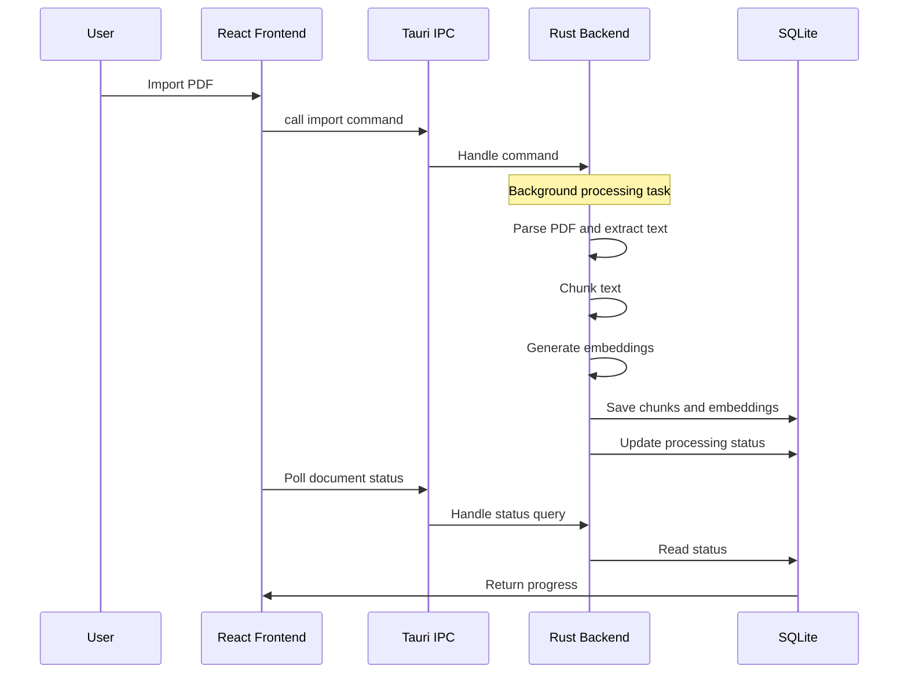

# PDF Processing Pipeline

MiniClue processes PDFs locally through a staged pipeline.

## Workflow

## Stages

1. Parse PDF text and metadata
2. Chunk text for retrieval
3. Generate embeddings
4. Persist chunks and vectors
5. Mark status as complete/failed

## Concurrency

Concurrent processing is bounded with a semaphore to protect system responsiveness.
